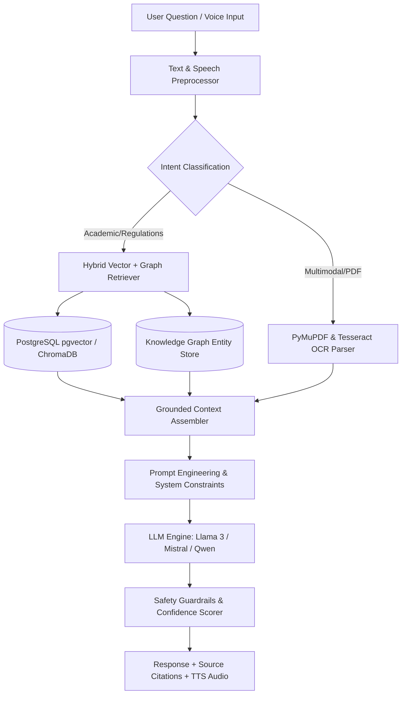

# Enterprise AI + RAG Architecture Specification
## Hybrid Knowledge Graph + Vector Database RAG Engine for GRI
**Author**: Principal AI Architect (Vijay Mahes)  
**Version**: 1.0.0  
**LLM Models**: Llama 3 (8B / 70B), Mistral 7B, Qwen 2.5  

---

## 1. System Architecture Overview

The **GRI AI Assistant** leverages a hybrid **Retrieval-Augmented Generation (RAG)** architecture combining vector similarity search (`ChromaDB` / PostgreSQL `pgvector`) with structural knowledge graphs (Neo4j / NetworkX) and local/cloud Open-Source LLMs (Llama 3, Mistral, Qwen 2.5).

---

## 2. Model Selection & Task Specialization

| Domain Task | Target LLM | Embedding Model | Rationale |
|---|---|---|---|
| **General Academic QA** | Llama 3 (8B-Instruct) | `all-MiniLM-L6-v2` (384d) | High-speed response, precise context adherence |
| **Multilingual (Tamil / English)** | Qwen 2.5 (7B) | `multilingual-e5-base` | Superior non-English / bilingual translation accuracy |
| **Research & Document Summarization** | Mistral 7B Instruct | `bge-large-en-v1.5` | Exceptional long-context comprehension & extraction |
| **Placement & Career Guidance** | Llama 3 (70B API) | `all-mpnet-base-v2` | Sophisticated reasoning & resume alignment |

---

## 3. RAG Triad Evaluation Metrics

To guarantee zero hallucinations and accurate institutional guidance, every response is evaluated against the **RAG Triad**:

1. **Context Relevance**: `Score >= 0.85` (Ensures retrieved chunks are directly related to user query).
2. **Groundedness / Faithfulness**: `Score >= 0.90` (Ensures response relies *only* on retrieved context).
3. **Answer Relevance**: `Score >= 0.88` (Ensures response directly answers student question).

If any metric falls below threshold, the assistant falls back to:  
*"I cannot find this information in the official GRI knowledge base. Please contact the GRI Helpdesk."*

---
*End of GRI AI RAG Architecture Specification.*
