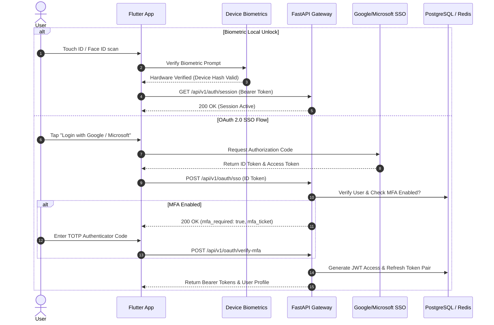

# Enterprise Authentication & Security Architecture
## Multi-Factor, Biometric, OAuth SSO & Session Management Specification
**Author**: Principal Security & Backend Architect (Vijay Mahes)  
**Version**: 1.0.0  

---

## 1. Enterprise Security Overview

The **Gandhigram Rural Institute (GRI)** mobile and web platform implements a defense-in-depth security model featuring:

- **OAuth 2.0 / OpenID Connect (OIDC)**: Single Sign-On (SSO) with **Google Workspace** & **Microsoft Entra ID / Azure AD**.
- **Multi-Factor Authentication (MFA)**: TOTP (Google Authenticator / Authy) + 6-digit SMS / Email OTP verification.
- **Biometric Local Authentication**: Native Face ID / Touch ID / Android Fingerprint unlock with hardware key storage.
- **Hardware & Device Binding**: Dynamic device fingerprinting (`device_hash`) to prevent token hijacking.
- **Token Management**: Short-lived JWT Access Tokens (24h) + Refresh Token Rotation with Redis blacklisting.
- **Role-Based Access Control (RBAC)**: Fine-grained scope checks (`student`, `faculty`, `parent`, `admin`, `warden`).
- **Audit Logging**: Immutable security audit trail logged to centralized monitoring.

---

## 2. Authentication Flow Diagram

---

## 3. RBAC Permission Matrix

| Role | Access Permissions |
|---|---|
| `student` | Read own grades, pay fees, view attendance, request hostel out-pass, query RAG AI Assistant |
| `faculty` | Mark classroom attendance, grade internal assignments, upload course material, view student roster |
| `parent` | View child attendance & grades, approve/reject hostel out-pass requests, pay tuition fees |
| `warden` | Manage hostel rooms, approve final gate passes, monitor night out-pass logs |
| `admin` | Full system access, manage user roles, audit security logs, configure feature flags |

---
*End of Enterprise Authentication Architecture Specification.*
