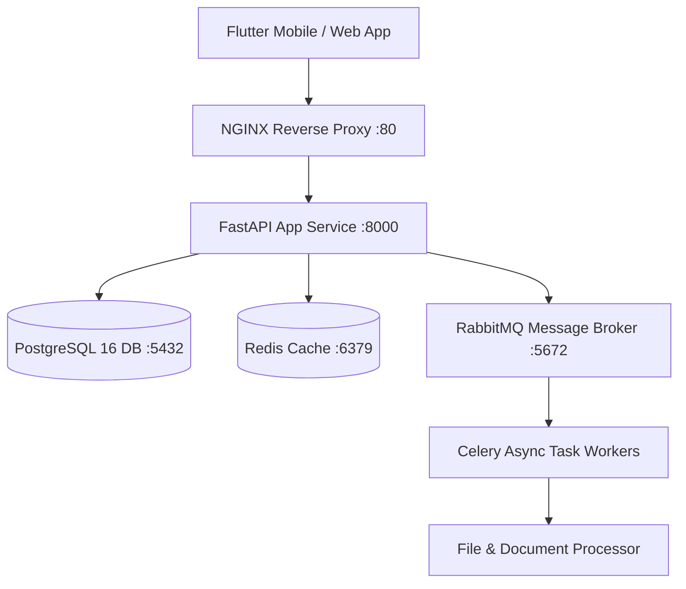

# GRI Production FastAPI Backend Architecture
## Microservices REST + GraphQL + Celery Workers + Docker Infrastructure
**Author**: Senior Backend Architect (Vijay Mahes)  
**Version**: 1.0.0  
**Framework**: FastAPI 0.111 / Python 3.11  

---

## 1. Directory Structure

```
backend/
├── app/
│   ├── api/
│   │   └── v1/
│   │       ├── endpoints/
│   │       │   ├── auth.py         # JWT Token Login & Security
│   │       │   ├── students.py     # Paginated Student CRUD
│   │       │   ├── files.py        # Upload, Image Resize & PDF Parsing
│   │       │   └── health.py       # Health Check & Monitoring
│   │       └── router.py
│   ├── core/
│   │   ├── config.py               # Pydantic BaseSettings Configuration
│   │   ├── security.py             # Password Hashing & JWT Validation
│   │   └── database.py             # SQLAlchemy Async Engine
│   ├── models/                     # SQLAlchemy Database Entities
│   ├── schemas/                    # Pydantic Request & Response Schemas
│   ├── tasks/                      # Celery Background Workers
│   └── main.py                     # FastAPI Application Initialization
├── Dockerfile                      # Production Container
├── docker-compose.yml              # Multi-container Compose Orchestration
├── nginx.conf                      # Reverse Proxy & Load Balancer Config
└── requirements.txt                # Python Dependencies Manifest
```

---

## 2. Infrastructure Architecture & Services



---

## 3. Endpoints & Swagger API Documentation

- **Swagger Interactive UI**: `http://localhost:8000/docs`
- **ReDoc Documentation**: `http://localhost:8000/redoc`
- **Prometheus Metrics**: `http://localhost:8000/metrics`

### Production Endpoints Implemented

| Method | Endpoint | Description |
|---|---|---|
| `POST` | `/api/v1/auth/login` | Authenticate & issuance of JWT Access Tokens |
| `GET` | `/api/v1/students` | Paginated listing of student records (`page`, `size`) |
| `POST` | `/api/v1/files/upload-image` | Upload image & generate auto-resized thumbnail |
| `POST` | `/api/v1/files/parse-pdf` | Upload PDF and extract text payload |
| `GET` | `/health` | Real-time service health check |

---
*End of GRI Backend Architecture Specification.*
