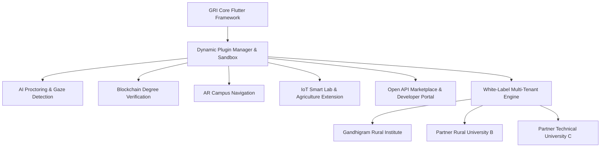
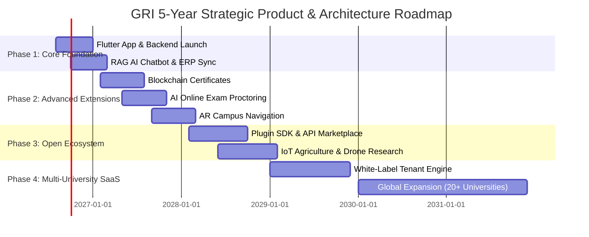

# Future Expansion, Plugin SDK & White-Label Multi-University Architecture
## 5-Year Product Roadmap, Monetization Strategy & Ecosystem Governance Model
**Author**: Chief Product & Technology Officer (CPTO) (Vijay Mahes)  
**Version**: 1.0.0  

---

## 1. Modular Ecosystem Architecture & Plugin SDK

The **GRI Digital Ecosystem** transforms into an extensible, micro-frontend platform powered by the **GRI Plugin SDK**. Third-party developers and partner universities can dynamically register custom modules without modifying core application code:

---

## 2. 5-Year Product Roadmap (2026 – 2031)

---

## 3. Monetization Strategy & Business Model

1. **White-Label Higher-Ed SaaS Subscriptions**:
   - **Base Tier**: $5,000/year per university (Core LMS, Attendance, Student Portal, ERP sync).
   - **Enterprise Tier**: $15,000/year (AI Proctoring, RAG Chatbot, Blockchain verification, Custom Branding).

2. **Open API Marketplace Revenue Share**:
   - 70/30 revenue split with third-party plugin developers selling specialized academic tools on the GRI Marketplace.

3. **Verification Fee per Transaction**:
   - **Blockchain Degree Verification**: $2.00 per instant employer verification check.

---

## 4. Governance & Plugin Security Audit Process

- **Security Sandboxing**: Plugins run in isolated Flutter sub-widgets with restricted API scopes.
- **Code Audit Pipeline**: All community plugins undergo automated SAST/DAST static code analysis and manual security review before release on the Open API Marketplace.

---
*End of GRI Future Expansion & Plugin Architecture Specification.*
