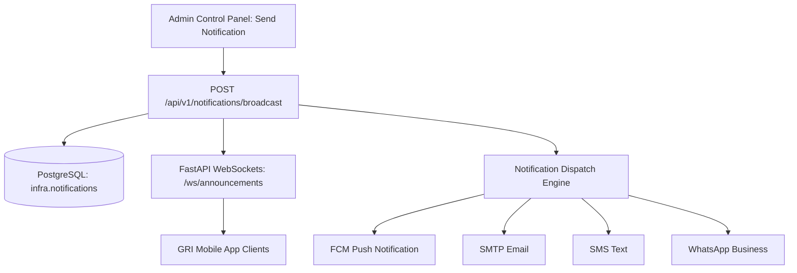

# Enterprise Omnichannel Notification Engine Architecture

## Push (FCM), SMS, Email, WhatsApp Business API & Emergency Broadcast System

---

## 1. Real-Time Admin Notification Broadcast System

The GRI Notification System empowers Administrators to broadcast real-time notifications to targeted university user groups via the **Admin Control Panel** (`/admin/index.html`):

---

## 2. Target Audience Filtering Matrix

Administrators can route announcements to specific user segments or the entire campus:

| Target Audience | Target Code | Estimated Reach | Typical Use Cases |
|---|---|---|---|
| **All Users** | `all` | 14,500+ recipients | Campus Emergency SOS, Holiday Notice, University Convocation |
| **Students Only** | `student` | 11,200+ students | ESE Exam Timetables, CIA Marks, Attendance Notices, Fee Deadlines |
| **Faculty Members Only** | `faculty` | 850+ teaching staff | Academic Council Meetings, Valuation Duties, Research Grants |
| **Non-Teaching Staff Only** | `staff` | 1,450+ staff | Departmental Circulars, Administrative Meetings |
| **Others / External / Alumni** | `other` | 1,000+ guests | Alumni Reunions, Public Guest Lectures, Open Workshops |

---

## 3. Real-Time Delivery Channels & WebSockets

- **WebSocket Push**: Endpoints connected at `/ws/announcements` receive instant JSON payloads (`type: "NOTIFICATION"` / `type: "EMERGENCY_ALERT"`).
- **PostgreSQL Database Log**: Every broadcast is recorded with `id`, `title`, `body`, `target_role`, `category`, `channels`, `recipient_count`, `sender`, and `created_at` in table `infra.notifications`.
- **Admin Audit Trail**: Every notification trigger generates an entry in `core.audit_log`.

---

## 4. Priority Queue & Fallback Rules

| Category | Target Audience | Channels | Priority Queue | SLA Delivery |
|---|---|---|---|---|
| **Emergency SOS** | All Users (`all`) | Push + SMS + Email | `High (Q1)` | `< 5 seconds` |
| **Placement Drives** | Students (`student`) | Push + Email + WhatsApp | `Medium (Q2)` | `< 1 minute` |
| **Exam & Results** | Students (`student`) | Push + Email | `Medium (Q2)` | `< 1 minute` |
| **Faculty Meetings** | Faculty (`faculty`) | Push + SMS + Email | `Medium (Q2)` | `< 1 minute` |
| **Fee Due Reminders** | Students (`student`) | Push + Email + SMS | `Normal (Q3)` | `< 5 minutes` |
