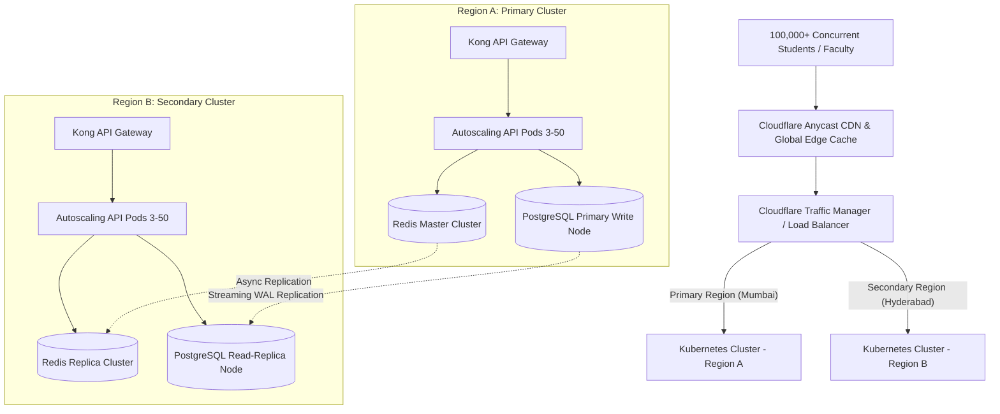

# Enterprise Scalability, High Availability & SRE Architecture
## Multi-Region Active-Active Deployment, DB Sharding, Edge CDN & Observability
**Author**: Principal SRE & Infrastructure Architect (Vijay Mahes)  
**Version**: 1.0.0  

---

## 1. High Availability System Architecture

The **Gandhigram Rural Institute (GRI)** system architecture guarantees **99.99% Availability SLA** through multi-region redundancy, auto-scaling microservices, edge caching, and distributed database replication:

---

## 2. Scalability & SRE Key Parameters

| Metric / Parameter | SLA / Architecture Target | Mechanism / Tool |
|---|---|---|
| **Service Availability SLA** | **99.99% Uptime** (Max 52 mins downtime/year) | Kubernetes Multi-Region Failover |
| **Peak Traffic Capacity** | **100,000 Active Concurrent Users** | HPA scaling (3 → 50 pods) + Cloudflare CDN |
| **API Response Latency** | `< 150ms` (P95) / `< 50ms` (P50) | Redis multi-tier caching + NGINX keepalive |
| **Recovery Point Objective (RPO)**| `< 60 seconds` | Streaming WAL replication to AWS S3 / MinIO |
| **Recovery Time Objective (RTO)**| `< 5 minutes` | Automated DNS health check failover |
| **Database Read Scaling** | 10,000 Queries Per Second (QPS) | Read-Replicas + Connection Pooling (PgBouncer) |
| **Observability & Tracing** | 100% Metrics / Logs / Traces | OpenTelemetry + Prometheus + Grafana + Loki |

---

## 3. Database Replication & Sharding Strategy

1. **Write Partitioning & Read Scaling**:
   - Single Primary Write Node with synchronous streaming replication to local Standby and asynchronous streaming to secondary region.
   - Read queries (e.g. searching courses, reading circulars, querying attendance history) are load balanced across **4 Read Replicas** via PgBouncer.

2. **Horizontal Table Sharding**:
   - `academic.attendance` and `infra.notifications` partitioned by date range (monthly/quarterly) to keep index size smaller than RAM for instant queries.

---
*End of GRI Scalability & Reliability Specification.*
