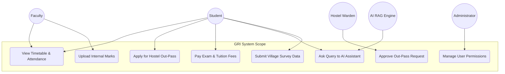
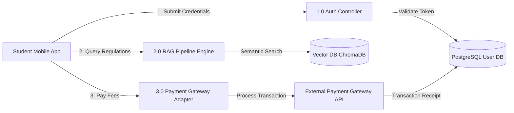
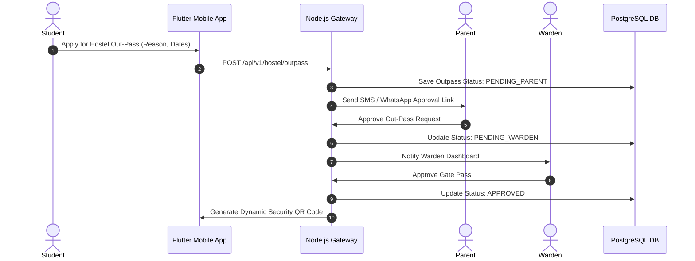
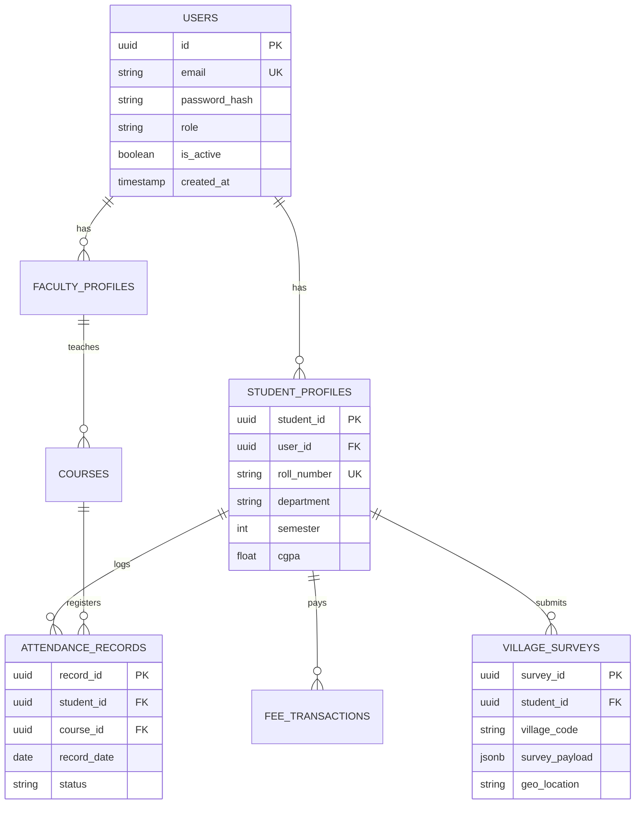
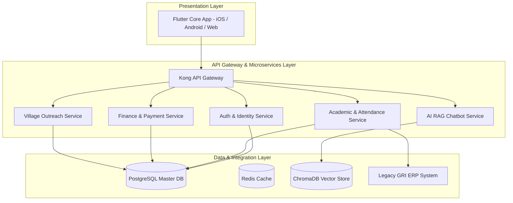

# Software Requirement Specification (SRS)
## Production-Ready Mobile & Web Application for Gandhigram Rural Institute (GRI)
**Website**: [https://ruraluniv.ac.in](https://ruraluniv.ac.in)  
**Document Version**: 1.0.0  
**Author**: Principal Solution Architect (Vijay Mahes)  
**Date**: August 2026  

---

## 1. Executive Summary & Ecosystem Overview

The **Gandhigram Rural Institute (GRI)** is a premier Deemed-to-be University established under Section 3 of the UGC Act, 1956, located in Dindigul, Tamil Nadu. GRI integrates higher education with Mahatma Gandhi's revolutionary concept of **Nai Talim (Basic Education)** and rural development.

This Software Requirement Specification (SRS) defines the end-to-end architecture, functional capabilities, non-functional requirements, data flows, entity relationships, and risk management strategies for a unified **Flutter Cross-Platform Application (Android, iOS, Web)** backed by a **Microservices Backend (Node.js / Python FastAPI)**, **Enterprise ERP Connectors**, and an **AI-driven Retrieval-Augmented Generation (RAG) Knowledge Assistant**.

---

## 2. Actors & Permissions Matrix

| Actor | Description | Primary Access Scopes |
| :--- | :--- | :--- |
| **Student** | Enrolled undergraduate, postgraduate, and research scholars. | Digital ID, Timetable, Attendance, Exam Results, Fee Payments, Library OPAC, Hostel Gate Passes, AI Assistant, Village Outreach Reports. |
| **Faculty** | Assistant/Associate Professors, HODs, and Deans. | Attendance Marking, Internal Assessment Ingestion, Course Syllabus Upload, Research Grant Management, Student Grievance Escalation. |
| **Parent** | Parents or guardians of enrolled students. | Fee Payment History, Academic Progress Reports, Attendance Alerts, Warden Approvals for Hostel Outings. |
| **Alumni** | Graduated students of GRI. | Alumni Network Directory, Mentorship Requests, Donation Portal, Job Referral Board. |
| **Administrator** | Departmental & Central IT System Administrators. | User Access Control, Role Management, Audit Logs, System Feature Flags, Master Config. |
| **Placement Officer** | Head of Campus Placements & Industry Relations. | Company Drive Creation, Eligibility Filtering, Resume Shortlisting, Interview Scheduling. |
| **Librarian** | Central Library Staff. | Cataloging, Book Issue/Return Ingestion, Fine Management, E-Resource Access Credentials. |
| **Hostel Warden** | In-charge of Boys/Girls Hostels & Mess. | Room Allocation, Night Pass Approvals, Mess Billing Validation, Maintenance Request Clearance. |
| **Finance Officer** | University Accounts & Billing Staff. | Fee Structure Configuration, Scholarship Disbursement, Reconciliation, Financial Audits. |
| **Exam Controller** | Office of Controller of Examinations (CoE). | Exam Scheduling, Hall Ticket Generation, Grade Card Processing, Re-evaluation Workflows. |
| **Outreach Coordinator** | Head of Extension & Rural Development Programs. | Village Survey Assignment, Field Project Tracking, Community Engagement Reports. |

---

## 3. Functional Requirements

### 3.1 Digital Identity & Access Management (FR-01)
- **FR-01.1**: Offline-capable Digital Student/Faculty ID card with dynamic QR code verification.
- **FR-01.2**: Encrypted NFC/Bluetooth beacon support for smart gate entry across campus.

### 3.2 Academic & Course Management (FR-02)
- **FR-02.1**: Semester course registration, credit tracking, elective selection.
- **FR-02.2**: Digital repository for lecture notes, lab manuals, and audio-visual resources.

### 3.3 Attendance System (FR-03)
- **FR-03.1**: Geofenced & Bluetooth Low Energy (BLE) classroom attendance for faculty.
- **FR-03.2**: Real-time attendance percentage alerts (threshold trigger at <75%).

### 3.4 Examination & Results (FR-04)
- **FR-04.1**: Online Hall Ticket download with fee clearance verification.
- **FR-04.2**: Semester Grade Point Average (SGPA) and Cumulative GPA (CGPA) calculator.

### 3.5 Finance & Online Payments (FR-05)
- **FR-05.1**: Integrated payment gateway (Razorpay/PayTM/UPI) for tuition, exam, hostel, and library fees.
- **FR-05.2**: Automated generation of GST-compliant digital tax receipts and fee certificates.

### 3.6 Library Management (FR-06)
- **FR-06.1**: Integrated Online Public Access Catalog (OPAC) search with RFID book locator.
- **FR-06.2**: Reserve books, track renewals, and pay overdue fines online.

### 3.7 Hostel & Mess Management (FR-07)
- **FR-07.1**: Room allotment system, maintenance ticket raising, and mess menu feedback.
- **FR-07.2**: Digital out-pass application with multi-level Warden and Parent SMS approval.

### 3.8 Placement & Career Portal (FR-08)
- **FR-08.1**: Automated resume builder with university-verified academic credentials.
- **FR-08.2**: Drive notifications, interview schedule calendar, and placement analytics dashboard.

### 3.9 AI Assistant & RAG Knowledge Engine (FR-09)
- **FR-09.1**: Conversational AI trained on GRI Ordinances, Regulations, Syllabus, and Circulars.
- **FR-09.2**: Voice-enabled multilingual query answering (Tamil & English).

### 3.10 Village Outreach & Rural Development (FR-10)
- **FR-10.1**: Geo-tagged village survey data collection module for Unnat Bharat Abhiyan (UBA) projects.
- **FR-10.2**: Extension activity logger for Gram Sabha meetings, health camps, and agricultural workshops.

---

## 4. Non-Functional Requirements (NFRs)

### 4.1 Performance & Responsiveness (NFR-01)
- **NFR-01.1**: API latency must not exceed **200ms** for 95% of read operations.
- **NFR-01.2**: Mobile UI must maintain a smooth **60 FPS** render rate on low-end devices.

### 4.2 Security & Compliance (NFR-02)
- **NFR-02.1**: End-to-end TLS 1.3 encryption for data in transit; AES-256 for sensitive data at rest.
- **NFR-02.2**: OAuth 2.0 + OpenID Connect with JWT access tokens and short-lived refresh token rotation.
- **NFR-02.3**: Compliance with Indian Digital Personal Data Protection (DPDP) Act 2023.

### 4.3 Scalability & Availability (NFR-03)
- **NFR-03.1**: 99.9% uptime SLA backed by Kubernetes multi-region deployment.
- **NFR-03.2**: Auto-scaling to handle peak load during Exam Result announcements (up to **100,000 active concurrent users**).

---

## 5. Architectural Diagrams (Mermaid)

### 5.1 System Use Case Diagram

---

### 5.2 Data Flow Diagram (DFD - Level 1)

---

### 5.3 Sequence Diagram: Student Out-Pass & Parent Approval Flow

---

### 5.4 Entity-Relationship Diagram (ERD)

---

### 5.5 Module Dependency Diagram

---

## 6. Risk Analysis & Mitigation Matrix

| Risk ID | Hazard Description | Probability | Severity | Mitigation Strategy |
| :--- | :--- | :---: | :---: | :--- |
| **RSK-01** | Server crash during annual semester exam result publishing due to traffic spikes. | High | Critical | Implement auto-scaling Kubernetes cluster, Cloudflare CDN response caching, and static JSON fallback endpoints. |
| **RSK-02** | Fraudulent biometric/geofenced attendance spoofing via mock location apps. | Medium | High | Enforce OS-level mock location detection, Wi-Fi BSSID handshake checks, and BLE beacon validation. |
| **RSK-03** | RAG AI Chatbot generating inaccurate hallucinated responses regarding academic rules. | Medium | High | Strict prompt engineering with explicit source context grounding; fall back to human helpdesk if confidence score < 0.85. |
| **RSK-04** | Loss of network connectivity during field surveys in remote rural villages. | High | Medium | Implement local SQLite storage with background sync queue (Offline-First architecture). |
| **RSK-05** | Unauthorized access to student financial records or grade modifications. | Low | Critical | Immutable database audit logs, strict RBAC enforcement, and quarterly penetration testing. |

---
*End of SRS Specification Document.*
