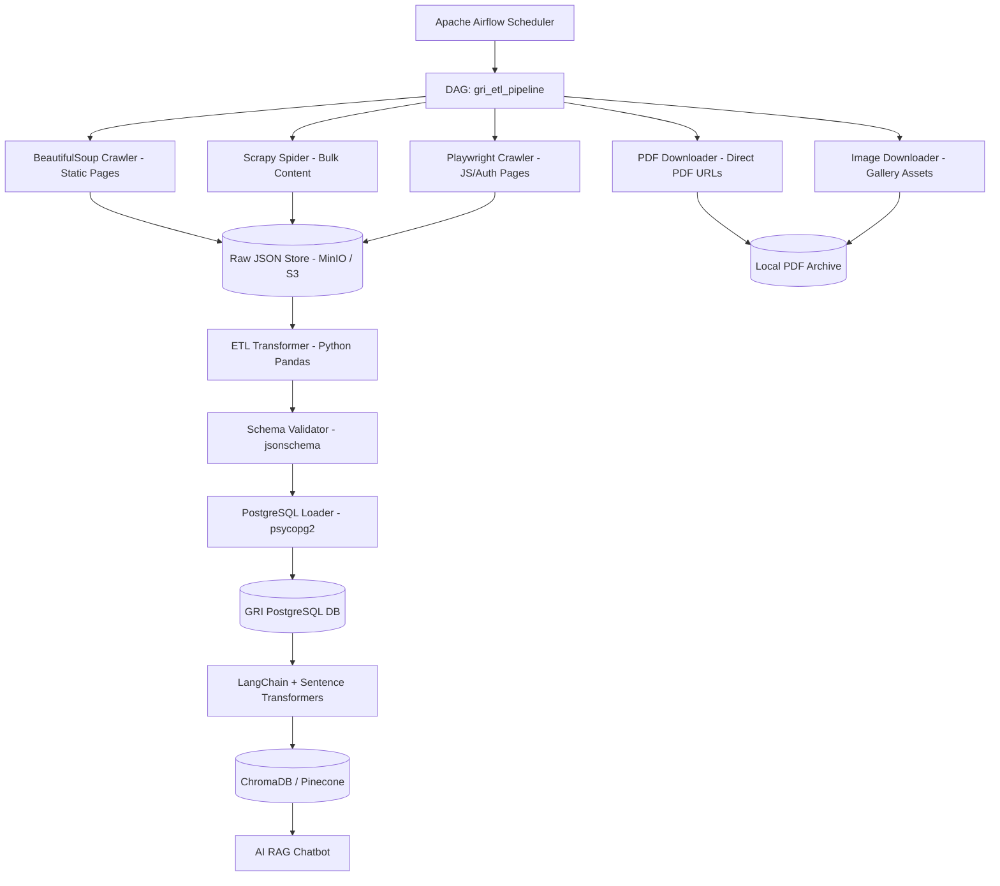

# GRI Data Collection Blueprint
## Production-Ready Web Scraping & ETL Architecture for ruraluniv.ac.in
**Version**: 1.0.0 | **Author**: Vijay Mahes | **Date**: August 2026

---

## 1. Website Analysis & Sitemap

### 1.1 Domain Architecture
| Property | Value |
|---|---|
| **Base URL** | `https://ruraluniv.ac.in` |
| **Technology** | PHP (`home.php`, `aboutgri`, `academics`), Server-rendered HTML |
| **Navigation Pattern** | Query-string routing (`?content=<key>`) |
| **JavaScript** | Minimal jQuery (CSS transitions only) — No SPA/Ajax routing |
| **Auth Wall** | Student Portal, Samarth ERP, Attendance system (external sub-domains) |
| **Robots.txt** | `https://ruraluniv.ac.in/robots.txt` |
| **Sitemap** | Not present (custom crawler required) |

---

### 1.2 Complete URL Inventory & Scraping Strategy

#### Core Pages

| Section | URL | HTML Pattern | Update Frequency | Strategy |
|---|---|---|---|---|
| Home | `https://ruraluniv.ac.in/home.php` | `<marquee>`, `<div id="tdi_gallery">` | Daily | BeautifulSoup + Requests |
| About GRI – Vision & Mission | `https://ruraluniv.ac.in/aboutgri?content=vm` | `<div id="content_area">` | Monthly | BeautifulSoup |
| About GRI – Profile | `https://ruraluniv.ac.in/aboutgri?content=profile` | Static HTML content | Quarterly | BeautifulSoup |
| About GRI – Campus | `https://ruraluniv.ac.in/aboutgri?content=campus` | Static HTML + images | Quarterly | BeautifulSoup + image downloader |
| Campus Map | `http://ruraluniv.ac.in/includes/aboutgri/map/map.html` | Embedded HTML map | Yearly | Playwright (iframe) |
| Location | `https://ruraluniv.ac.in/gridu?content=location` | Static HTML | Yearly | BeautifulSoup |

#### Academics

| Section | URL | Strategy |
|---|---|---|
| CBCS System | `https://ruraluniv.ac.in/academics?content=CBCSsystem` | BeautifulSoup |
| Programmes | `https://ruraluniv.ac.in/academics?content=programmes` | BeautifulSoup (table parse) |
| Schools / Faculties | `https://ruraluniv.ac.in/academics?content=faculties` | BeautifulSoup (structured list) |
| Centre for Women's Studies | `https://ruraluniv.ac.in/academics?content=womensstudies` | BeautifulSoup |
| Centre for Geoinformatics | `https://ruraluniv.ac.in/academics?content=geoinformatics` | BeautifulSoup |
| RDC (Research & Dev Cell) | `https://ruraluniv.ac.in/academics?content=Home` | BeautifulSoup |
| Student's Handbook | `https://ruraluniv.ac.in/academics?content=calendar` | PDF download |

#### Admissions

| Section | URL | Strategy |
|---|---|---|
| Prospectus 2026-27 | `https://ruraluniv.ac.in/includes/admissions/2026/pdf/Prospectus_202627.pdf` | Direct PDF download |
| Prospectus 2025-26 | `https://ruraluniv.ac.in/includes/admissions/2025/pdf/Prospectus_202526.pdf` | Direct PDF download |
| M.Phil. Regulations | `https://ruraluniv.ac.in/admissions?content=MPhil_Regulations` | BeautifulSoup + PDF |
| Ph.D. Regulations | `https://ruraluniv.ac.in/admissions?content=PhD_Regulations` | BeautifulSoup + PDF |
| D.Sc. & D.Litt. Regs | `https://ruraluniv.ac.in/admissions?content=Dsc_Regulations` | BeautifulSoup |
| Fee Refund Policy | `https://ruraluniv.ac.in/admn1?content=Refund` | BeautifulSoup |
| Hostel Fees | `https://ruraluniv.ac.in/admn1?content=Hostel_fee` | BeautifulSoup (table parse) |
| CUET Admission 2026 | `https://ruraluniv.ac.in/admissions?content=Admission2026` | BeautifulSoup |

#### Examination

| Section | URL | Strategy |
|---|---|---|
| Exam System | `https://ruraluniv.ac.in/examination?content=ExaminationSystem` | BeautifulSoup |
| Exam Timetable | `http://ruraluniv.ac.in/examtt` | Playwright (dynamic table render) |
| Application for Transcript | `http://ruraluniv.ac.in/includes/examination/pdf/Application_Transcript.pdf` | PDF download |
| Duplicate Cert. Form | `http://ruraluniv.ac.in/includes/examination/pdf/DuplicateCertificate.pdf` | PDF download |
| Ph.D. Tracking System | `https://ruraluniv.ac.in/GRIIMS1/` | Playwright (authenticated) |
| e-SANAD Notification | `http://ruraluniv.ac.in/includes/examination/pdf/e-sanad301221.pdf` | PDF download |

#### Governance

| Section | URL | Strategy |
|---|---|---|
| Governance System | `https://ruraluniv.ac.in/Governance?content=System` | BeautifulSoup |
| Board of Management | `https://ruraluniv.ac.in/Governance?content=BOM_Constitution` | BeautifulSoup (table) |
| Finance Committee | `https://ruraluniv.ac.in/Governance?content=FinanceCommittee_Composition` | BeautifulSoup |
| Academic Council | `https://ruraluniv.ac.in/Governance?content=AcademicCouncil_Composition` | BeautifulSoup |

#### Administration

| Section | URL | Strategy |
|---|---|---|
| Chancellor | `https://ruraluniv.ac.in/administration?content=chancellor` | BeautifulSoup + image |
| Vice-Chancellor | `https://ruraluniv.ac.in/administration?content=vc` | BeautifulSoup + image |
| Registrar | `https://ruraluniv.ac.in/administration?content=registrar` | BeautifulSoup + image |
| CoE | `https://ruraluniv.ac.in/administration?content=coe` | BeautifulSoup + image |
| Finance Officer | `https://ruraluniv.ac.in/administration?content=financeofficer` | BeautifulSoup + image |
| Deans | `https://ruraluniv.ac.in/administration?content=deans` | BeautifulSoup (table) |
| HODs | `https://ruraluniv.ac.in/administration?content=hod` | BeautifulSoup (table) |

#### Facilities

| Section | URL | Strategy |
|---|---|---|
| Library | `https://ruraluniv.ac.in/facilities?content=library` | BeautifulSoup |
| Computer Centre | `https://ruraluniv.ac.in/gri?CC=about` | BeautifulSoup |
| Physical Education | `https://ruraluniv.ac.in/facilities?content=phyedu` | BeautifulSoup |
| Nano Centre | `https://ruraluniv.ac.in/facilities?content=About_NANO_Facility` | BeautifulSoup |
| Instrument Facility | `https://ruraluniv.ac.in/facilities?content=About_NMR_Facility` | BeautifulSoup |
| XRD Facility | `https://ruraluniv.ac.in/facilities?content=About_XRD_Facility` | BeautifulSoup |
| UBA Seaweed Startup | `https://ruraluniv.ac.in/facilities?content=SEAWEED_1` | BeautifulSoup |
| Museum | `https://ruraluniv.ac.in/facilities?content=museum` | BeautifulSoup |

#### Infrastructure

| Section | URL | Strategy |
|---|---|---|
| Hostels | `https://ruraluniv.ac.in/infrastructure?content=AboutHostel` | BeautifulSoup |
| Guest House | `https://ruraluniv.ac.in/infrastructure?content=guesthouse` | BeautifulSoup |
| Health Centre | `https://ruraluniv.ac.in/infrastructure?content=AboutHealthCentre` | BeautifulSoup |
| Examination Hall | `https://ruraluniv.ac.in/infrastructure?content=ExamHall` | BeautifulSoup |

#### News, Notices & Events

| Section | URL | Strategy |
|---|---|---|
| e-News 2026 | `https://ruraluniv.ac.in/includes/enews/2k26` | BeautifulSoup (paginated) |
| e-News 2025 | `https://ruraluniv.ac.in/includes/enews/2k25` | BeautifulSoup |
| e-News 2024 | `https://ruraluniv.ac.in/includes/enews/2k24` | BeautifulSoup |
| Gallery Images | `https://ruraluniv.ac.in/images/tdi_gallery/` | Image downloader |

#### Portals & ERP (External / Authenticated)

| Section | URL | Notes |
|---|---|---|
| Student Portal | `https://portal.ruraluniv.ac.in/` | Requires student login — Selenium/Playwright |
| Attendance Portal | `https://attendance.ruraluniv.ac.in/` | Requires login |
| Samarth ERP | `https://ruraluniv.samarth.ac.in/` | OAuth2 login required |
| Ph.D. Tracking | `https://ruraluniv.ac.in/GRIIMS1/` | Requires login |
| Alumni Portal | `https://ruraluniv.ac.in/includes/AlumniGRI` | Scrapy |
| Webmail | `https://webmail.ruraluniv.ac.in/` | Out of scope |

---

## 2. JSON Schemas

### 2.1 Department Schema
```json
{
  "$schema": "http://json-schema.org/draft-07/schema",
  "type": "object",
  "properties": {
    "id":          { "type": "string", "description": "UUID" },
    "slug":        { "type": "string", "description": "URL-safe identifier" },
    "name":        { "type": "string" },
    "school":      { "type": "string", "description": "Parent school/faculty name" },
    "hod":         { "type": "string", "description": "Head of Department name" },
    "email":       { "type": "string", "format": "email" },
    "phone":       { "type": "string" },
    "about":       { "type": "string" },
    "programmes":  { "type": "array", "items": { "type": "string" } },
    "source_url":  { "type": "string", "format": "uri" },
    "scraped_at":  { "type": "string", "format": "date-time" }
  },
  "required": ["id", "name", "slug", "source_url", "scraped_at"]
}
```

### 2.2 Programme Schema
```json
{
  "$schema": "http://json-schema.org/draft-07/schema",
  "type": "object",
  "properties": {
    "id":            { "type": "string" },
    "name":          { "type": "string" },
    "degree_type":   { "type": "string", "enum": ["UG", "PG", "M.Phil.", "Ph.D.", "Diploma", "Certificate", "B.Voc.", "ITEP"] },
    "department":    { "type": "string" },
    "duration_years":{ "type": "number" },
    "credits":       { "type": "integer" },
    "intake":        { "type": "integer" },
    "eligibility":   { "type": "string" },
    "syllabus_url":  { "type": "string", "format": "uri" },
    "source_url":    { "type": "string", "format": "uri" },
    "scraped_at":    { "type": "string", "format": "date-time" }
  }
}
```

### 2.3 News / Circular / Notice Schema
```json
{
  "$schema": "http://json-schema.org/draft-07/schema",
  "type": "object",
  "properties": {
    "id":           { "type": "string" },
    "type":         { "type": "string", "enum": ["news", "circular", "notice", "tender", "event", "result"] },
    "title":        { "type": "string" },
    "body":         { "type": "string" },
    "published_at": { "type": "string", "format": "date-time" },
    "expiry_at":    { "type": ["string", "null"], "format": "date-time" },
    "attachments":  {
      "type": "array",
      "items": {
        "type": "object",
        "properties": {
          "filename": { "type": "string" },
          "url":      { "type": "string", "format": "uri" },
          "mime":     { "type": "string" }
        }
      }
    },
    "source_url":   { "type": "string", "format": "uri" },
    "scraped_at":   { "type": "string", "format": "date-time" }
  }
}
```

### 2.4 Faculty / Administration Personnel Schema
```json
{
  "$schema": "http://json-schema.org/draft-07/schema",
  "type": "object",
  "properties": {
    "id":            { "type": "string" },
    "name":          { "type": "string" },
    "designation":   { "type": "string" },
    "department":    { "type": "string" },
    "qualification": { "type": "string" },
    "specialization":{ "type": "string" },
    "email":         { "type": "string", "format": "email" },
    "phone":         { "type": "string" },
    "photo_url":     { "type": "string", "format": "uri" },
    "research_areas":{ "type": "array", "items": { "type": "string" } },
    "publications_count": { "type": "integer" },
    "source_url":    { "type": "string", "format": "uri" },
    "scraped_at":    { "type": "string", "format": "date-time" }
  }
}
```

### 2.5 Gallery Image Schema
```json
{
  "$schema": "http://json-schema.org/draft-07/schema",
  "type": "object",
  "properties": {
    "id":          { "type": "string" },
    "filename":    { "type": "string" },
    "caption":     { "type": "string" },
    "event_date":  { "type": "string", "format": "date" },
    "remote_url":  { "type": "string", "format": "uri" },
    "local_path":  { "type": "string" },
    "scraped_at":  { "type": "string", "format": "date-time" }
  }
}
```

---

## 3. Database Schema (PostgreSQL)

```sql
-- =============================================
-- GRI Data Collection Database Schema
-- =============================================

CREATE EXTENSION IF NOT EXISTS "uuid-ossp";

-- Departments
CREATE TABLE departments (
    id            UUID PRIMARY KEY DEFAULT uuid_generate_v4(),
    slug          VARCHAR(100) UNIQUE NOT NULL,
    name          TEXT NOT NULL,
    school        TEXT,
    hod           TEXT,
    email         TEXT,
    phone         TEXT,
    about         TEXT,
    source_url    TEXT NOT NULL,
    scraped_at    TIMESTAMPTZ DEFAULT NOW(),
    updated_at    TIMESTAMPTZ DEFAULT NOW()
);

-- Programmes
CREATE TABLE programmes (
    id             UUID PRIMARY KEY DEFAULT uuid_generate_v4(),
    name           TEXT NOT NULL,
    degree_type    VARCHAR(20) CHECK (degree_type IN ('UG','PG','M.Phil.','Ph.D.','Diploma','Certificate','B.Voc.','ITEP')),
    department_id  UUID REFERENCES departments(id),
    duration_years NUMERIC(3,1),
    credits        INTEGER,
    intake         INTEGER,
    eligibility    TEXT,
    syllabus_url   TEXT,
    source_url     TEXT NOT NULL,
    scraped_at     TIMESTAMPTZ DEFAULT NOW()
);

-- Faculty & Administration Personnel
CREATE TABLE personnel (
    id              UUID PRIMARY KEY DEFAULT uuid_generate_v4(),
    name            TEXT NOT NULL,
    designation     TEXT,
    category        VARCHAR(30) CHECK (category IN ('faculty','administration','governance')),
    department_id   UUID REFERENCES departments(id),
    qualification   TEXT,
    specialization  TEXT,
    email           TEXT,
    phone           TEXT,
    photo_url       TEXT,
    source_url      TEXT NOT NULL,
    scraped_at      TIMESTAMPTZ DEFAULT NOW()
);

-- News / Circulars / Notices / Events
CREATE TABLE announcements (
    id            UUID PRIMARY KEY DEFAULT uuid_generate_v4(),
    type          VARCHAR(20) CHECK (type IN ('news','circular','notice','tender','event','result')),
    title         TEXT NOT NULL,
    body          TEXT,
    published_at  TIMESTAMPTZ,
    expiry_at     TIMESTAMPTZ,
    source_url    TEXT NOT NULL,
    scraped_at    TIMESTAMPTZ DEFAULT NOW()
);

-- Announcement Attachments
CREATE TABLE announcement_attachments (
    id               UUID PRIMARY KEY DEFAULT uuid_generate_v4(),
    announcement_id  UUID REFERENCES announcements(id) ON DELETE CASCADE,
    filename         TEXT,
    remote_url       TEXT,
    local_path       TEXT,
    mime_type        TEXT,
    downloaded_at    TIMESTAMPTZ
);

-- Gallery
CREATE TABLE gallery (
    id           UUID PRIMARY KEY DEFAULT uuid_generate_v4(),
    filename     TEXT NOT NULL,
    caption      TEXT,
    event_date   DATE,
    remote_url   TEXT UNIQUE NOT NULL,
    local_path   TEXT,
    scraped_at   TIMESTAMPTZ DEFAULT NOW()
);

-- Downloaded Documents (PDFs, Brochures, etc.)
CREATE TABLE documents (
    id           UUID PRIMARY KEY DEFAULT uuid_generate_v4(),
    title        TEXT,
    category     VARCHAR(50),
    remote_url   TEXT UNIQUE NOT NULL,
    local_path   TEXT,
    file_size_kb INTEGER,
    downloaded_at TIMESTAMPTZ,
    scraped_at   TIMESTAMPTZ DEFAULT NOW()
);

-- Scraper Run Audit Log
CREATE TABLE scraper_runs (
    id            UUID PRIMARY KEY DEFAULT uuid_generate_v4(),
    spider_name   TEXT NOT NULL,
    target_url    TEXT,
    status        VARCHAR(20) CHECK (status IN ('success','failed','partial')),
    records_found INTEGER DEFAULT 0,
    errors        TEXT,
    started_at    TIMESTAMPTZ,
    finished_at   TIMESTAMPTZ
);

-- Indexes for Performance
CREATE INDEX idx_announcements_type   ON announcements(type);
CREATE INDEX idx_announcements_date   ON announcements(published_at DESC);
CREATE INDEX idx_programmes_dept      ON programmes(department_id);
CREATE INDEX idx_gallery_date         ON gallery(event_date DESC);
```

---

## 4. Crawler Architecture



---

## 5. ETL Pipeline Design

### 5.1 Apache Airflow DAG Structure
```
gri_etl_pipeline (Daily @ 02:00 IST)
├── Task Group: crawl_static
│   ├── crawl_home
│   ├── crawl_about
│   ├── crawl_academics
│   ├── crawl_admissions
│   ├── crawl_examination
│   ├── crawl_facilities
│   ├── crawl_infrastructure
│   └── crawl_governance
│
├── Task Group: crawl_dynamic
│   ├── playwright_examtt       (Exam Timetable)
│   └── playwright_enews        (e-News listing)
│
├── Task Group: download_assets
│   ├── download_pdfs
│   └── download_gallery_images
│
├── Task Group: transform_validate
│   ├── transform_departments
│   ├── transform_programmes
│   ├── transform_personnel
│   ├── transform_announcements
│   └── validate_all_schemas
│
└── Task Group: load
    ├── load_to_postgres
    └── embed_to_vectordb
```

### 5.2 Update Frequency Matrix

| Data Type | Frequency | Method |
|---|---|---|
| Gallery Images / Events | Daily | Scrapy + BeautifulSoup |
| Circulars / Notices / News | Daily | BeautifulSoup |
| Exam Timetable | Weekly | Playwright |
| Faculty / Personnel | Monthly | BeautifulSoup |
| Programmes / Curriculum | Quarterly | BeautifulSoup + PDF |
| Prospectus / Regulations | Per-release | Manual trigger + PDF download |
| Governance / Committees | Quarterly | BeautifulSoup |
| Gallery archive (historical) | One-time seed | Scrapy bulk crawl |

---

## 6. Automation Plan & Tool Stack

### 6.1 Open-Source Toolchain

| Tool | Role | Version |
|---|---|---|
| **Python 3.11** | Core scripting language | 3.11+ |
| **Scrapy 2.11** | High-performance bulk web crawler | 2.11 |
| **BeautifulSoup4** | HTML parser for static pages | 4.12 |
| **Playwright (Python)** | Headless browser for JS/dynamic pages | 1.44 |
| **Selenium** | Fallback browser automation | 4.20 |
| **Apache Airflow 2.9** | ETL workflow scheduling & monitoring | 2.9 |
| **jsonschema** | JSON schema validation | 4.22 |
| **pandas** | Data transformation and normalization | 2.2 |
| **psycopg2** | PostgreSQL adapter | 2.9 |
| **SQLAlchemy** | ORM for database loading | 2.0 |
| **Pillow** | Image optimization | 10.3 |
| **PyMuPDF (fitz)** | PDF text extraction | 1.24 |
| **LangChain** | Vector embedding pipeline | 0.2 |
| **MinIO** | S3-compatible raw JSON object store | latest |
| **Redis** | Scrapy crawl deduplication cache | 7.2 |

### 6.2 Project Structure
```
research/data_collection/
├── scrapers/
│   ├── gri_static_spider.py       # Scrapy: static page crawl
│   ├── gri_bs4_parser.py          # BeautifulSoup: page-specific parsers
│   ├── gri_playwright_spider.py   # Playwright: JS + auth pages
│   ├── gri_pdf_downloader.py      # PDF bulk downloader
│   └── gri_image_downloader.py    # Gallery image downloader
├── schemas/
│   ├── department_schema.json
│   ├── programme_schema.json
│   ├── announcement_schema.json
│   ├── personnel_schema.json
│   └── gallery_schema.json
├── etl/
│   ├── transformer.py             # Normalize & clean raw scraped data
│   ├── validator.py               # jsonschema validation
│   ├── loader.py                  # PostgreSQL + VectorDB loader
│   └── airflow_dag.py             # Apache Airflow DAG definition
└── data_collection_blueprint.md   # This document
```

---

## 7. Data Ownership & Compliance

| Category | Owner | Notes |
|---|---|---|
| Academic Content | Gandhigram Rural Institute – DTbU | All rights reserved. For internal app use only. |
| Faculty Photos / Profiles | Individual Faculty Members | Consent required for public display. |
| Prospectus / PDFs | GRI Publications Cell | Republication requires attribution. |
| Gallery Images | GRI Media Office | Use only within GRI official app. |
| e-News Content | GRI Communication Office | Internal use; no commercial redistribution. |
| Examination Timetables | GRI Controller of Examinations | Accuracy disclaimer required. |

> **Compliance**: All data collection is for use within the official **GRI Mobile Application** exclusively. No public redistribution. Data access governed by the **Indian Digital Personal Data Protection (DPDP) Act, 2023**.

---

*End of GRI Data Collection Blueprint.*
